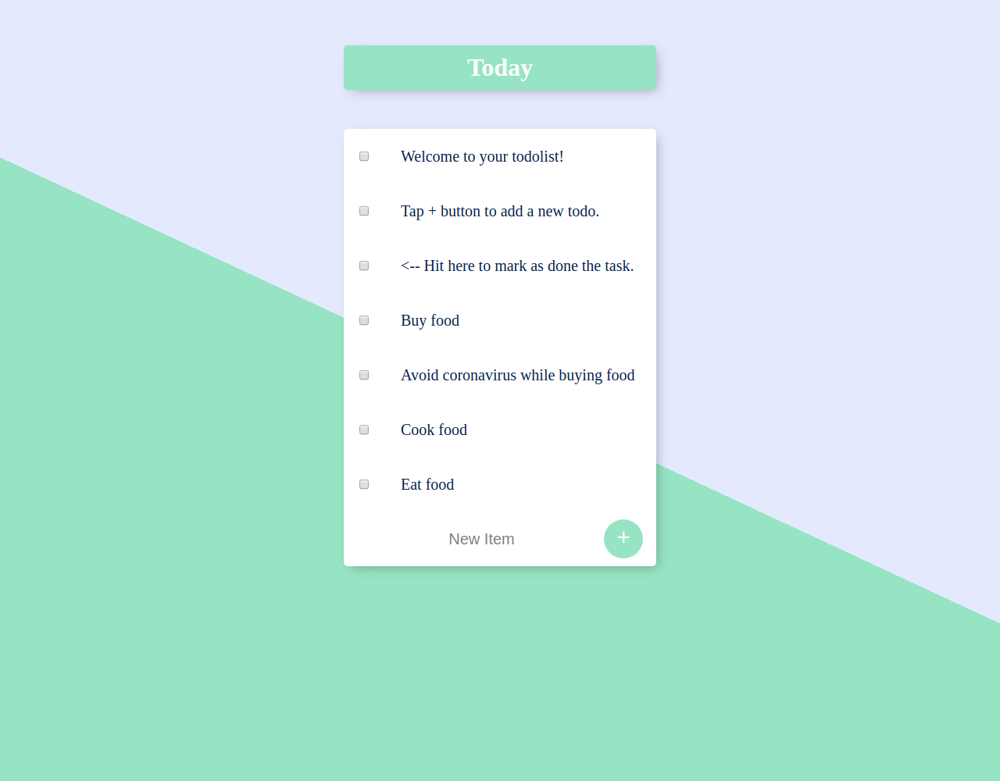

# ToDo List

- Front-end: HTML (EJS) and CSS.
- Back-end: Node.js and MongoDB.
 
---

---

## Description
Using a node.js server and a mongoDB database, the todo list can be used accessing the localhost:3000.

The interface is intuitive, there's a quick tutorial as default tasks.

The user can write the task in the  text input field, then press "+" button to add a new task. Also can check the checkbox to mark it as done.

The tasks are stored in the database named "todolistDB", in the "items" collection.

---

## Changelog
### 1.0.0 (2020-03-26)
- Only the bare bones, but working.